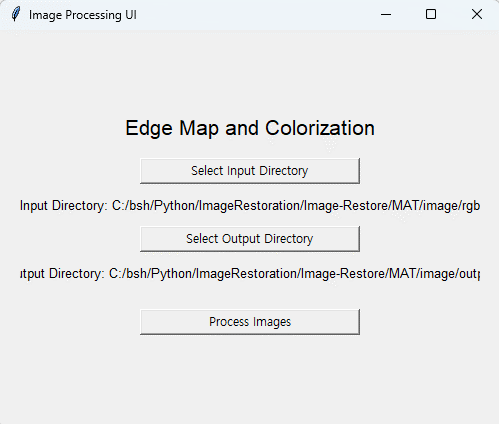
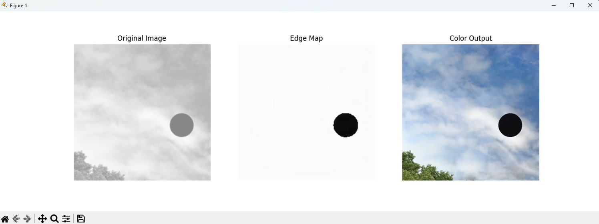

# Image-Restore
## 1. Summarize
손상된 GRAYSCALE 영상을 입력으로 받아 Mask Map을 추출 -> Colorization -> Inpainting을 수행하는 Application 프로젝트

## 2. Architecture
MaskMapGenerator (UNet) -> Colorization Network -> Inpaint Network

## 3. Application

